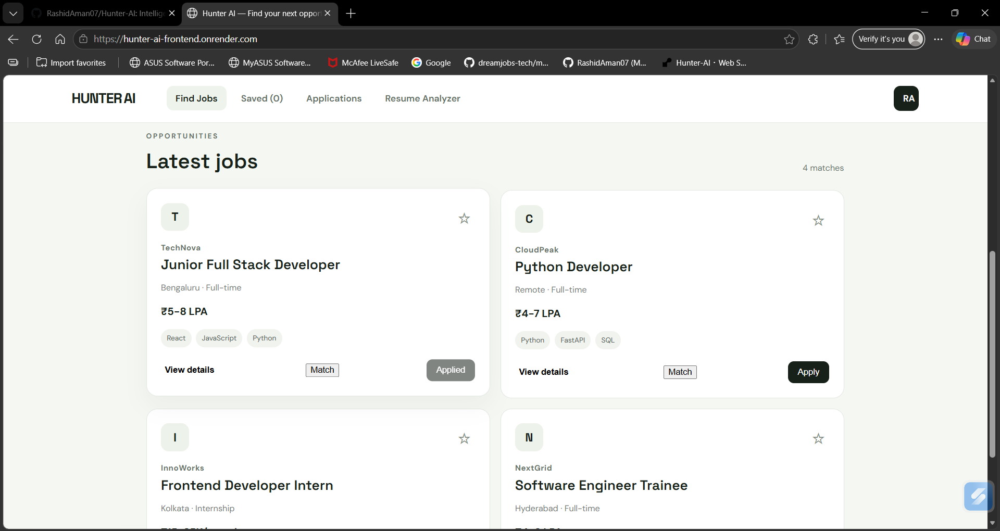
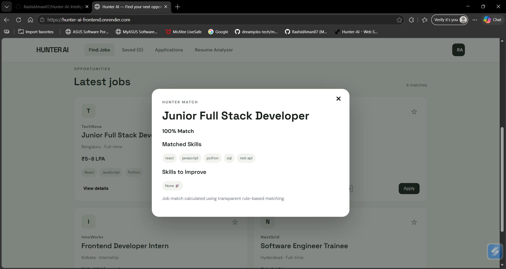
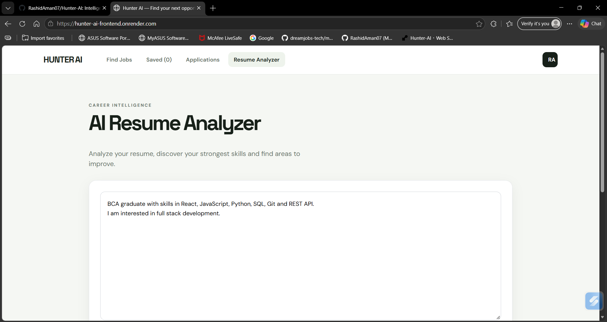

# 🚀 Hunter AI — Intelligent Job & Career Platform

Hunter AI is a full-stack job and career platform that helps users discover relevant opportunities, analyze their resume skills, and evaluate how well their profile matches a job.

The project is built with React, FastAPI, REST APIs, and SQLAlchemy, with a deployment-ready architecture for modern web applications.

## 🌐 Live Demo

**Live Application:**  
https://hunter-ai-frontend.onrender.com

**Backend API:**  
https://hunter-ai-i596.onrender.com

**API Documentation:**  
https://hunter-ai-i596.onrender.com/docs

---

## ✨ Features
## 📸 Screenshots

### 🔎 Job Search

Users can browse available opportunities and filter jobs by their requirements.



### 🎯 Job Matching

Hunter AI compares the user's skills with the skills required for a job and calculates a transparent match score.



### 📄 Resume Analyzer

The resume analyzer detects skills, identifies areas for improvement, and suggests relevant roles.



### 🔎 Job Search & Discovery
- Browse available job opportunities
- Search jobs by keywords
- Filter jobs by location and job type
- View job details
- Display salary, experience, skills, and description

### 🎯 Job Match
Hunter AI compares a user's resume text with the skills required for a selected job.

It provides:
- Match percentage
- Matched skills
- Missing skills
- Transparent matching explanation

The current matching engine uses rule-based skill matching.

### 📄 Resume Analyzer
Users can paste their resume text and receive:
- Resume score
- Detected skills
- Skills to improve
- Recommended job roles

The current analyzer uses a transparent rule-based approach rather than an external LLM.

### 💼 Job Applications
- Apply to jobs
- Track applied jobs during the session

### 🔖 Saved Jobs
- Save interesting jobs
- Keep saved jobs in browser local storage

### 🌍 Full-Stack Deployment
The application is deployed using:
- Render Static Site for the frontend
- Render Web Service for the backend
- Environment variables for deployment configuration
- CORS configuration for frontend/backend communication

---

## 🛠️ Tech Stack

### Frontend
- React
- JavaScript
- Vite
- CSS
- Fetch API
- Browser Local Storage

### Backend
- Python
- FastAPI
- SQLAlchemy
- REST API
- Pydantic

### Database
- SQLite for local development
- PostgreSQL-ready database configuration

### Deployment
- GitHub
- Render
- Docker

---

## 🏗️ Architecture

```text
                    ┌──────────────────────┐
                    │       User           │
                    │   Web Browser        │
                    └──────────┬───────────┘
                               │
                               ▼
                    ┌──────────────────────┐
                    │   React + Vite       │
                    │     Frontend         │
                    └──────────┬───────────┘
                               │
                         REST API / HTTP
                               │
                               ▼
                    ┌──────────────────────┐
                    │    FastAPI Backend   │
                    │      Python          │
                    └──────────┬───────────┘
                               │
               ┌───────────────┼───────────────┐ 
               │               │               │
               ▼               ▼               ▼
        ┌────────────┐  ┌─────────────┐  ┌─────────────┐
        │ Job APIs   │  │   Resume    │  │ Job Match   │
        │            │  │  Analyzer   │  │   Engine    │
        └─────┬──────┘  └─────────────┘  └─────────────┘
              │
              ▼
        ┌────────────────┐
        │   Database     │
        │ SQLite /       │
        │ PostgreSQL     │
        └────────────────┘